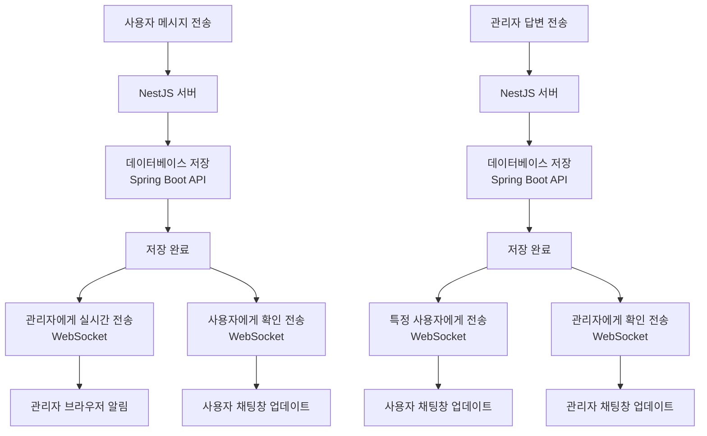
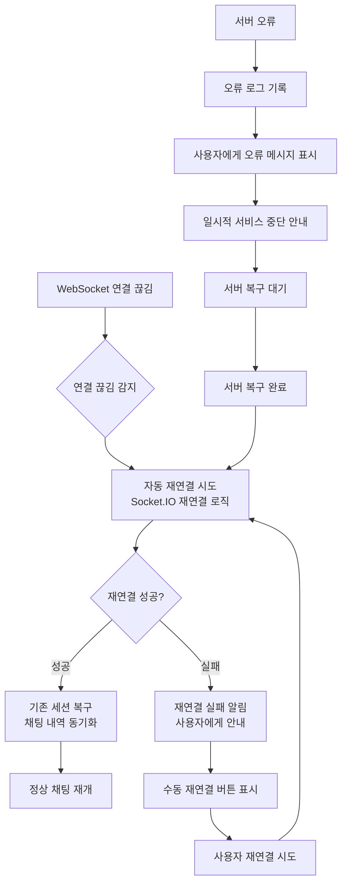
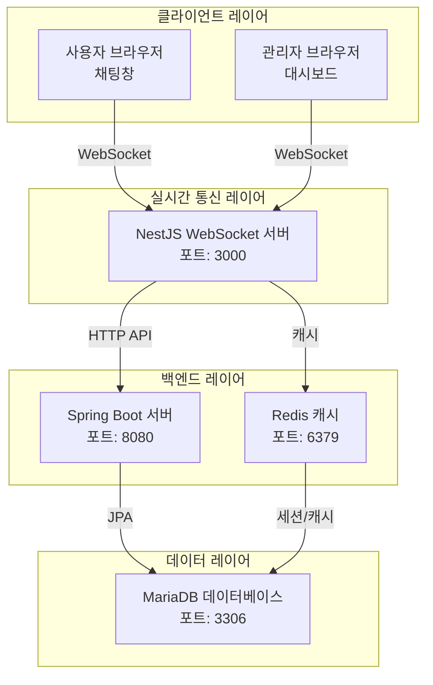

# 채팅 시스템 전체 플로우차트

## 1. 시스템 초기화 및 연결 플로우

```mermaid
flowchart TD
    A[서버 시작] --> B[Spring Boot 서버 시작<br/>포트: 8080]
    B --> C[NestJS WebSocket 서버 시작<br/>포트: 3000]
    C --> D[Redis 연결 설정<br/>캐시 및 세션 관리]
    D --> E[데이터베이스 연결<br/>MariaDB]
    
    F[관리자 접속] --> G[관리자 대시보드 로드<br/>/admin/chat]
    G --> H[관리자 WebSocket 연결<br/>Socket.IO]
    H --> I[관리자 그룹 참가<br/>socket.join('admin')]
    I --> J[기존 채팅 내역 확인]
    J --> K{기존 채팅 있음?}
    K -->|있음| L[기존 채팅방 목록 표시<br/>미읽 메시지 카운트]
    K -->|없음| M[빈 대시보드 표시<br/>대기 중인 사용자 없음]
    
    L --> N[관리자 대기 상태]
    M --> N
```

## 2. 사용자 채팅 시작 플로우

```mermaid
flowchart TD
    A[사용자 웹사이트 접속] --> B[채팅 버튼 클릭]
    B --> C[채팅창 UI 로드<br/>chat.js 실행]
    C --> D[사용자 WebSocket 연결<br/>Socket.IO]
    D --> E[사용자 고유 ID 생성<br/>UUID 또는 세션 ID]
    E --> F[사용자 그룹 참가<br/>socket.join(userId)]
    F --> G[채팅창 활성화<br/>메시지 입력 가능]
    
    G --> H[사용자 메시지 입력]
    H --> I[메시지 전송<br/>socket.emit('sendMessage')]
    I --> J[NestJS 서버 메시지 수신]
    J --> K[메시지 데이터베이스 저장<br/>Spring Boot API 호출]
    K --> L[메시지 저장 완료]
    
    L --> M[관리자에게 메시지 전송<br/>server.to('admin').emit('userMessage')]
    L --> N[사용자에게 확인 메시지 전송<br/>server.to(userId).emit('chatMessage')]
    
    M --> O[관리자 브라우저 알림 표시<br/>Notification API]
    N --> P[사용자 채팅창에 메시지 표시<br/>내가 보낸 메시지 확인]
```

## 3. 관리자 채팅 응답 플로우

```mermaid
flowchart TD
    A[관리자 브라우저 알림 수신] --> B[알림 클릭 또는 대시보드 확인]
    B --> C[새 채팅방 상단에 추가<br/>동적 UI 업데이트]
    C --> D[미읽 메시지 카운트 증가<br/>배지 표시]
    D --> E[관리자 채팅방 클릭]
    E --> F[채팅방 활성화<br/>미읽 카운트 리셋]
    F --> G[과거 채팅 내역 요청<br/>socket.emit('getHistory')]
    G --> H[NestJS 서버 내역 요청 처리]
    H --> I[Spring Boot API 호출<br/>데이터베이스 조회]
    I --> J[채팅 내역 반환<br/>socket.emit('chatHistory')]
    J --> K[관리자 채팅창에 내역 표시]
    
    K --> L[관리자 답변 입력]
    L --> M[답변 전송<br/>socket.emit('sendMessage')]
    M --> N[NestJS 서버 메시지 수신]
    N --> O[메시지 데이터베이스 저장]
    O --> P[특정 사용자에게 답변 전송<br/>server.to(userId).emit('adminReply')]
    O --> Q[관리자 채팅창에 답변 표시<br/>server.to('admin').emit('adminReply')]
    
    P --> R[사용자 채팅창에 답변 표시]
    Q --> S[관리자 채팅창에 답변 표시]
```

## 4. 실시간 양방향 통신 플로우



## 5. 채팅 종료 및 연결 해제 플로우

```mermaid
flowchart TD
    A[사용자 채팅 종료] --> B[채팅창 닫기]
    B --> C[WebSocket 연결 해제<br/>socket.disconnect()]
    C --> D[NestJS 서버 연결 해제 감지]
    D --> E[사용자 그룹에서 제거<br/>socket.leave(userId)]
    E --> F[관리자에게 사용자 오프라인 알림<br/>server.to('admin').emit('userOffline')]
    F --> G[관리자 대시보드 업데이트<br/>사용자 상태 변경]
    
    H[관리자 채팅 종료] --> I[관리자 대시보드 닫기]
    I --> J[WebSocket 연결 해제<br/>socket.disconnect()]
    J --> K[NestJS 서버 연결 해제 감지]
    K --> L[관리자 그룹에서 제거<br/>socket.leave('admin')]
    L --> M[관리자 오프라인 상태]
    
    N[서버 종료] --> O[모든 WebSocket 연결 강제 해제]
    O --> P[Redis 캐시 정리]
    P --> Q[데이터베이스 연결 종료]
```

## 6. 에러 처리 및 복구 플로우



## 7. 전체 시스템 아키텍처



## 주요 기술 스택 및 포트

- **Spring Boot**: 8080 포트 (메인 애플리케이션 서버)
- **NestJS**: 3000 포트 (WebSocket 실시간 통신 서버)
- **Redis**: 6379 포트 (캐시 및 세션 관리)
- **MariaDB**: 3306 포트 (데이터베이스)
- **Socket.IO**: 실시간 양방향 통신
- **Notification API**: 브라우저 내장 알림

## 핵심 기능 요약

1. **실시간 양방향 통신**: Socket.IO를 통한 즉시 메시지 전송
2. **브라우저 알림**: 관리자에게 새 채팅 도착 시 자동 알림
3. **동적 UI 업데이트**: 새 채팅방 자동 생성 및 미읽 카운트 관리
4. **채팅 내역 관리**: 데이터베이스 저장 및 과거 내역 조회
5. **연결 안정성**: 자동 재연결 및 에러 처리
6. **확장성**: Redis를 통한 세션 관리 및 캐싱 