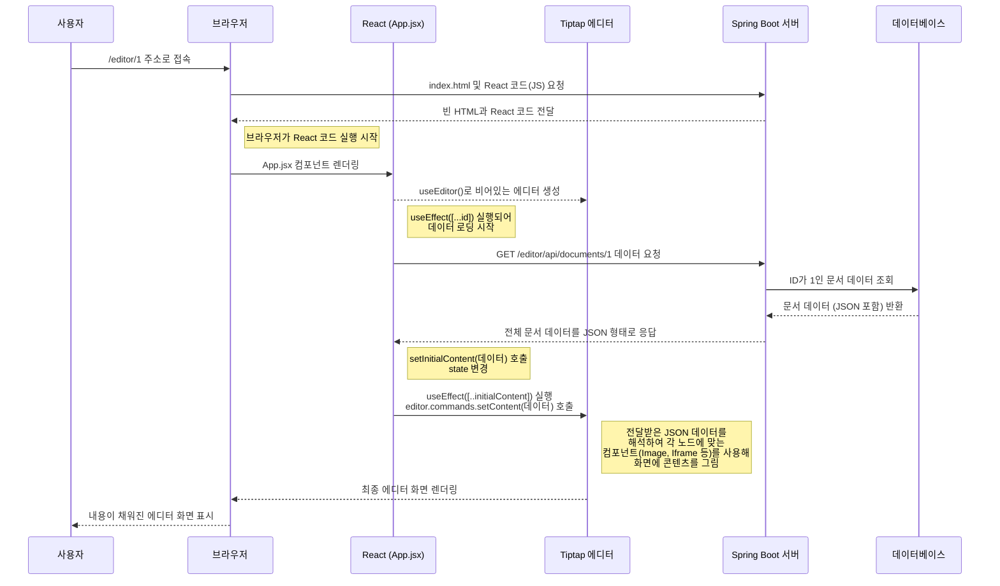

# Nexus 에디터 기술 명세서 및 매뉴얼

이 문서는 Nexus 프로젝트의 Tiptap 에디터 기능에 대한 기술적인 설명과 작동 방식을 정리한 매뉴얼입니다. React, JSX 등 새로운 기술 스택에 익숙하지 않은 팀원들이 코드의 전체 구조를 이해하는 것을 돕는 것을 목표로 합니다.

---

## 1. 기본 개념: Spring Boot/Thymeleaf vs React

이 프로젝트의 에디터는 기존의 Spring Boot/Thymeleaf 방식과 다르게 작동합니다.

-   **Thymeleaf (서버 사이드 렌더링)**: 서버가 데이터와 HTML을 모두 조합하여 **완성된 웹페이지**를 브라우저에 보냅니다.
-   **React (클라이언트 사이드 렌더링)**: 서버는 최소한의 HTML과 **기능이 담긴 JavaScript 코드**를 보냅니다. 브라우저가 이 JavaScript 코드를 실행하여 동적으로 화면을 그리고 데이터와 상호작용합니다.

이 JavaScript 코드의 부품 하나하나를 **컴포넌트(Component)** 라고 부르며, `.jsx` 확장자를 가진 파일들이 바로 이 컴포넌트 파일입니다.

---

## 2. 주요 기술 스택

-   **React**: UI를 만들기 위한 JavaScript 라이브러리. 컴포넌트 기반으로 작동합니다.
-   **Vite**: 프론트엔드 개발 서버 및 빌드 도구. (Spring Boot의 내장 Tomcat/Gradle과 유사한 역할)
-   **Tiptap**: 'Headless' 위지윅(WYSIWYG) 에디터 라이브러리. 디자인이 없는 기능 뼈대만 제공하여 커스터마이징이 자유롭습니다.
-   **JSX**: JavaScript 파일(`.jsx`) 안에서 HTML처럼 UI 구조를 작성할 수 있게 해주는 문법입니다.

---

## 3. 데이터 처리 흐름 (시나리오: 저장된 문서 열기)



---

## 4. 파일별 상세 분석

### 4.1. `src/main/frontend/src/App.jsx`

| 항목 | 설명 |
| :--- | :--- |
| **파일명** | `App.jsx` |
| **기술** | React, Tiptap |
| **파일 역할** | 에디터의 **총괄 본부**. 에디터의 모든 기능을 제어하고, 상태를 관리하며, 모든 UI 컴포넌트(사이드바, 모달, 에디터 본문)를 조립하는 가장 중요한 파일입니다. |

#### 주요 변수 (State)

| 변수명 | 역할 |
| :--- | :--- |
| `id` | URL에서 가져온 현재 문서의 고유 ID. (예: `/editor/123`) |
| `is[ModalName]Open` | 각 모달창(Image, Settings 등)의 열림/닫힘 상태(true/false)를 기억. |
| `editorStyles` | 에디터 전체의 배경색, 글꼴 등 디자인 스타일 값을 기억하는 객체. |
| `projectSettings` | 현재 문서의 제목, 커버 이미지, 태그 등 부가 정보를 기억하는 객체. |
| `initialContent` | 서버에서 불러온 문서 원본(JSON)을 임시로 저장하는 변수. |
| `isLoading` | 서버로부터 데이터를 불러오는 중인지 여부(true/false)를 기억. |
| `editor` | `useEditor` 훅으로 생성된 Tiptap 에디터의 핵심 인스턴스. 모든 에디터 조작은 이 객체를 통해 이루어집니다. |

#### 주요 메소드 (Functions)

| 메소드명 | 역할 |
| :--- | :--- |
| `useEditor({...})` | Tiptap 에디터를 생성하고 설정합니다. 사용할 확장 기능(Extension)들을 `extensions` 배열에 등록합니다. |
| `useEffect(..., [id])` | **데이터 로딩 함수**. 페이지에 처음 접속하거나 URL의 `id`가 바뀔 때 실행됩니다. 서버 API를 호출하여 문서 데이터를 가져와 `initialContent`와 `projectSettings` 상태를 업데이트합니다. |
| `useEffect(..., [initialContent])` | **에디터 내용 주입 함수**. 데이터 로딩이 완료되어 `initialContent`의 값이 바뀌면, 그 내용을 실제 에디터 화면에 `setContent` 명령어로 채워 넣습니다. |
| `handle[Action]()` | **이벤트 핸들러**. `handleSaveDocument`, `handleImageAdd` 등 사용자의 클릭과 같은 행동에 반응하여 특정 로직을 수행합니다. (예: 모달 열기, 상태 변경, 서버 요청 등) |

### 4.2. `src/main/frontend/src/Sidebar.jsx`

| 항목 | 설명 |
| :--- | :--- |
| **파일명** | `Sidebar.jsx` |
| **기술** | React |
| **파일 역할** | 에디터 좌측에 위치하는 **메뉴 UI 컴포넌트**. 콘텐츠 추가, 스타일 변경, 설정 등 각종 기능을 실행하는 버튼들을 담고 있습니다. |
| **흐름** | 1. `App.jsx`로부터 `editor` 객체와 `onImageAdd` 같은 함수들을 `props`로 전달받습니다. <br> 2. 사용자가 'Image' 버튼을 누르면, `App.jsx`에서 전달받은 `onImageAdd` 함수를 호출합니다. <br> 3. 실제 로직은 `App.jsx`에 있는 `onImageAdd` 함수가 실행하여 처리합니다. (예: 이미지 업로드 모달을 엶) |

### 4.3. Node 정의 파일 (예: `src/main/frontend/src/PaywallNode.jsx`)

| 항목 | 설명 |
| :--- | :--- |
| **파일명** | `*Node.jsx` (e.g., `PaywallNode.jsx`, `IframeNode.jsx`) |
| **기술** | Tiptap |
| **파일 역할** | Tiptap 에디터에 **새로운 종류의 콘텐츠를 등록하는 설정 파일**. '이런 속성을 가진 이런 이름의 콘텐츠가 있다'고 에디터에게 알려주는 역할을 합니다. |

#### 주요 설정 (Properties)

| 속성명 | 역할 |
| :--- | :--- |
| `name` | 콘텐츠 타입의 고유 이름. (예: 'paywall', 'iframe') |
| `group` | 'block'(단락) 또는 'inline'(글자) 중 어디에 속하는지 정의. |
| `atom` | `true`로 설정 시, 내부를 수정할 수 없는 하나의 덩어리로 취급. |
| `draggable`| `true`로 설정 시, 드래그 핸들로 위치를 옮길 수 있음. |
| `addAttributes()` | 이 콘텐츠 타입이 가질 수 있는 속성들을 정의. (예: 이미지의 `src`, `width`) |
| `parseHTML()` | 저장된 HTML을 다시 에디터로 불러올 때, 어떤 HTML 태그를 이 노드로 변환할지 규칙을 정의. |
| `renderHTML()` | 에디터의 내용을 실제 HTML로 저장할 때, 이 노드를 어떤 HTML 태그로 변환할지 규칙을 정의. |
| `addNodeView()`| 에디터 안에서 이 노드가 보여질 때, 어떤 React 컴포넌트(`*Component.jsx`)를 사용할지 연결. |
| `addCommands()` | 이 노드와 관련된 새로운 명령어(예: `setPaywall`)를 만들어, `editor.chain()...`으로 사용할 수 있게 함. |

### 4.4. Node 뷰 컴포넌트 (예: `src/main/frontend/src/PaywallComponent.jsx`)

| 항목 | 설명 |
| :--- | :--- |
| **파일명** | `*Component.jsx` (e.g., `PaywallComponent.jsx`, `ImageComponent.jsx`) |
| **기술** | React |
| **파일 역할** | `*Node.jsx`에서 정의한 콘텐츠가 **에디터 화면에 실제로 어떻게 보일지**를 결정하는 UI 부품. |
| **흐름** | 1. `*Node.jsx`의 `addNodeView()`에 의해 연결됩니다.<br> 2. Tiptap으로부터 `node`, `updateAttributes` 등의 `props`를 받아 현재 상태(예: 이미지 너비)를 화면에 그리고, 변경 사항을 Tiptap에 다시 알려주는 역할을 합니다. <br> 3. `NodeViewWrapper`라는 Tiptap 제공 컴포넌트로 전체를 감싸야 Tiptap이 제어할 수 있습니다. |

### 4.5. 모달 컴포넌트 (예: `src/main/frontend/src/ImageUploadModal.jsx`)

| 항목 | 설명 |
| :--- | :--- |
| **파일명** | `*Modal.jsx` |
| **기술** | React |
| **파일 역할** | 이미지 업로드나 링크 입력 등, **사용자와의 특정 상호작용을 위해 띄우는 팝업창 UI**. |
| **흐름** | 1. `App.jsx`에서 모달의 열림/닫힘 상태(`isImageModalOpen`)를 관리합니다. <br> 2. `App.jsx`로부터 `onClose`, `onImageAdd` 같은 함수를 `props`로 전달받습니다. <br> 3. 사용자가 모달 안에서 작업을 완료하면 (예: 파일 업로드 성공), 전달받은 `onImageAdd` 함수를 호출하여 그 결과(이미지 URL)를 `App.jsx`로 다시 알려줍니다. <br> 4. `onClose` 함수를 호출하여 스스로를 닫습니다. |
``` 
</rewritten_file>