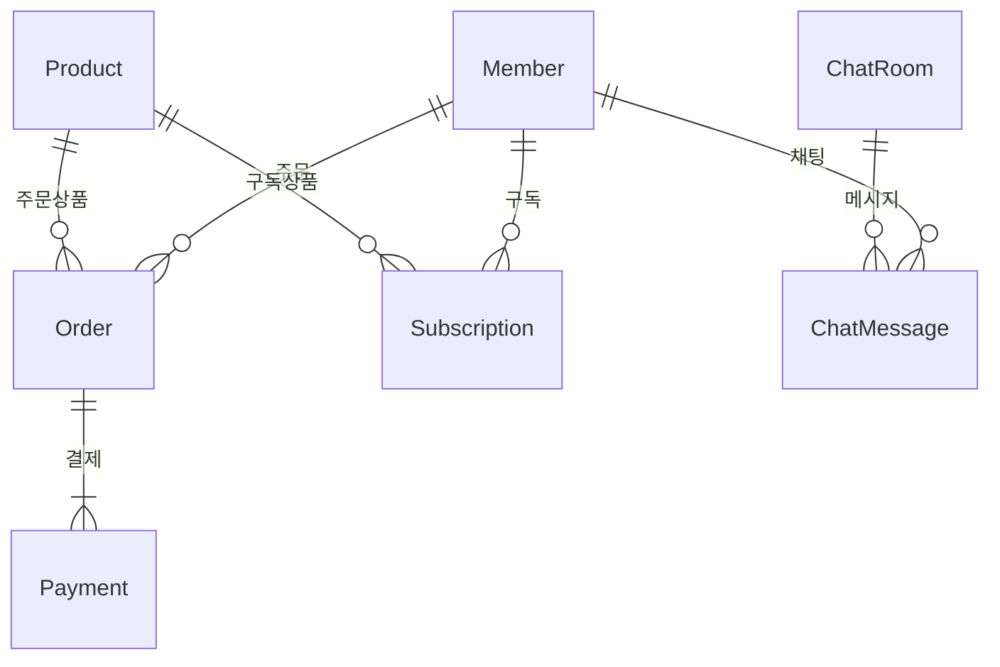

# Nexus 프로젝트 기술 명세서

---

## 1. 프로젝트 개요

Nexus 프로젝트는 실시간 채팅, 상품/주문/구독, 관리자 대시보드, 에디터 등 다양한 기능을 통합한 풀스택 웹 서비스입니다. 
- **목적:** 크리에이터와 사용자가 실시간으로 소통하고, 상품을 등록/구매/구독할 수 있는 통합 플랫폼 제공
- **주요 기능:**
  - 실시간 채팅/알림 (NestJS, Socket.IO)
  - 상품/주문/구독 관리 (Spring Boot, JPA)
  - 관리자/사용자 대시보드 (React, Vite, Tailwind)
  - 에디터 SPA (React, Tailwind)
  - 서버사이드 렌더링(SSR) (Thymeleaf)
  - Docker 기반 멀티컨테이너 배포
- **전체 아키텍처:**
  - Spring Boot(REST/SSR) + NestJS(실시간) + React SPA + Docker

---

## 2. 주요 기술 스택

| 영역         | 기술/프레임워크                       | 설명                                      |
|--------------|--------------------------------------|-------------------------------------------|
| 백엔드       | Spring Boot, Spring Data JPA, Thymeleaf | REST API, DB 연동, 서버사이드 렌더링      |
| DB           | H2 (테스트), RDBMS                   | JPA 기반 ORM, 테스트용 H2 내장 DB         |
| 실시간 서버  | NestJS, Socket.IO                    | 실시간 채팅/알림, 관리자 대시보드 연동    |
| 프론트엔드   | React, Vite, TailwindCSS, Bootstrap  | SPA, 에디터, 관리자 UI, 스타일링          |
| 템플릿       | Thymeleaf                            | 서버사이드 HTML 렌더링                    |
| 배포/운영    | Docker, Docker Compose               | 컨테이너 기반 개발/운영 환경              |
| 기타         | Lombok, ESLint, PostCSS, Vite        | 코드 생산성, 정적분석, 빌드 최적화        |

---

## 3. 폴더/모듈 구조

```
프로젝트 루트/
├─ src/main/java/com/creatorworks/nexus/
│    ├─ member/         # 회원/인증/구독 도메인
│    ├─ order/          # 주문/결제 도메인
│    ├─ product/        # 상품 도메인
│    ├─ chat/           # 채팅 도메인
│    ├─ notification/   # 알림 도메인
│    ├─ ...             # 기타 도메인/공통
│    └─ ...
├─ src/main/resources/
│    ├─ templates/      # Thymeleaf HTML 템플릿
│    ├─ static/         # 정적 리소스(CSS, JS, 이미지)
│    └─ ...
├─ src/main/chatManager/   # React 기반 관리자 채팅 대시보드
├─ src/main/editor/        # Vite+React+Tailwind 기반 에디터 SPA
├─ notification-server/    # NestJS 기반 실시간 서버(WebSocket)
├─ docker-compose.yml      # 멀티컨테이너 오케스트레이션
└─ ...
```

- 각 폴더별 역할:
  - `member/`, `order/`, `product/` 등: 도메인별 계층 구조(controller, service, repository, entity)
  - `templates/`: SSR용 HTML 템플릿(Thymeleaf)
  - `static/`: 정적 리소스(빌드된 JS/CSS, 이미지 등)
  - `chatManager/`, `editor/`: React/Vite SPA 소스
  - `notification-server/`: 실시간 채팅/알림 서버

---

## 4. 기능별 상세 설명

### 4.1. 회원/인증
- 회원가입, 로그인, 권한(ROLE_USER, ROLE_ADMIN 등)
- Spring Security 기반 인증/인가, JWT/세션 관리
- 회원 정보, 구독 정보, 포인트 등 관리

### 4.2. 상품/주문/구독
- 상품 등록/조회/수정/삭제 (JPA, REST API)
- 주문/결제/구독 관리 (정기결제, 아임포트 연동)
- 관리자/사용자별 주문/구독 내역 조회, 통계

### 4.3. 실시간 채팅/알림
- NestJS + Socket.IO 기반 실시간 채팅/알림
- 관리자 대시보드에서 실시간 상담, 사용자 메시지 관리
- 채팅 내역 DB 저장, 오프라인 사용자도 내역 보존
- WebSocket 연결/해제, 이벤트 기반 메시지 송수신

### 4.4. 에디터/프론트엔드
- React + Vite + TailwindCSS 기반 SPA 에디터
- 다양한 입력 폼, 모달, 실시간 미리보기, 태그/카테고리 관리
- TailwindCSS로 빠른 UI 스타일링, 일부 Bootstrap 혼용
- 컴포넌트 기반 구조, 상태 관리, API 연동

### 4.5. 템플릿/SSR
- Thymeleaf로 서버사이드 렌더링(로그인, 상품, 주문 등)
- 동적 데이터 바인딩, 조건문, 반복문 등 활용
- SSR + SPA 혼합 구조 지원

### 4.6. 배포/운영
- Dockerfile, docker-compose.yml로 멀티 컨테이너 관리
- 개발/운영 환경 분리, 환경변수/설정파일 관리
- CI/CD 확장 가능

---

## 5. 데이터베이스/ERD 개요

### 주요 엔티티 및 관계
- Member(회원), Product(상품), Order(주문), Subscription(구독), Payment(결제), ChatMessage(채팅)



---

## 6. 실시간/비동기 구조

- **NestJS + Socket.IO**로 실시간 채팅/알림 처리
- WebSocket 연결/해제, 사용자/관리자 그룹 관리
- 메시지/이벤트 송수신, DB 연동(Spring Boot REST API 호출)
- 채팅 내역, 알림 내역 DB 저장 및 조회
- 관리자 대시보드(React)와 실시간 연동

---

## 7. 프론트엔드 구조

- **React + Vite** 기반 SPA (에디터, 관리자 대시보드)
- **TailwindCSS**로 유틸리티 클래스 기반 빠른 스타일링
- 일부 Bootstrap 혼용 가능
- 주요 컴포넌트: 모달, 폼, 리스트, 대시보드, 채팅창 등
- 상태 관리: useState, useEffect, Context 등 활용
- API 연동: axios 등으로 REST/실시간 서버와 통신

---

## 8. 배포/운영

- **Docker**로 각 서비스(백엔드, 프론트, 실시간 서버) 컨테이너화
- **docker-compose**로 멀티컨테이너 오케스트레이션
- 개발/운영 환경 분리, 환경변수(.env, properties) 관리
- 빌드/배포 자동화(CI/CD 확장 가능)

---

## 9. 학습/확장 포인트

- Spring Boot + JPA + Thymeleaf의 서버사이드 웹 개발
- React + Vite + TailwindCSS의 SPA 개발
- NestJS + Socket.IO의 실시간 통신 구조
- Docker를 활용한 멀티모듈/멀티컨테이너 환경
- REST API와 WebSocket의 차이, 연동 방법
- 프론트엔드와 백엔드의 통합(SSR + SPA + 실시간)
- 확장: 마이크로서비스 분리, 클라우드 배포, CI/CD, 보안 강화 등

---

## 10. 참고/부록

- [Spring Boot 공식 문서](https://spring.io/projects/spring-boot)
- [NestJS 공식 문서](https://docs.nestjs.com/)
- [React 공식 문서](https://react.dev/)
- [TailwindCSS 공식 문서](https://tailwindcss.com/)
- [Docker 공식 문서](https://docs.docker.com/)
- [Socket.IO 공식 문서](https://socket.io/docs/)

---

> 이 문서는 Nexus 프로젝트의 전체 구조와 기술 흐름을 한눈에 파악하고, 각 영역별로 학습/확장할 수 있도록 작성되었습니다. 실제 코드/구현과 함께 참고하면 더욱 효과적입니다. 