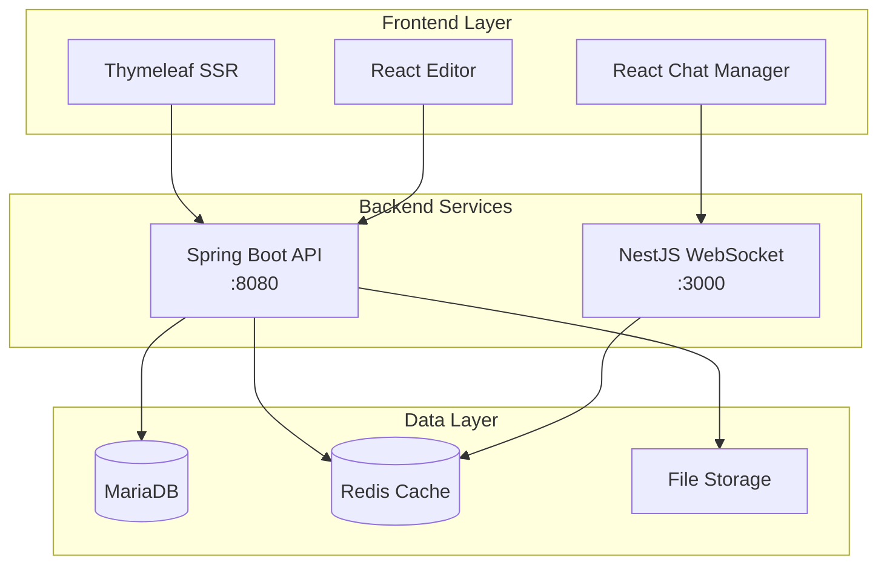

# 🎨 Nexus - Creative Auction Platform

<div align="center">
  
[](https://spring.io/projects/spring-boot)
[](https://reactjs.org/)
[](https://nestjs.com/)
[](https://www.typescriptlang.org/)
[](https://www.docker.com/)
[](LICENSE)

**실시간 입찰과 창작물 거래를 위한 종합 경매 플랫폼**

[🚀 시작하기](#-빠른-시작) • [📚 문서](#-프로젝트-구조) • [💡 기능](#-주요-기능) • [🤝 기여하기](#-기여-방법)

</div>

---

## 📌 프로젝트 소개

**Nexus**는 창작자와 구매자를 연결하는 실시간 경매 플랫폼입니다. 디지털 창작물, 예술 작품, 프로젝트를 실시간으로 거래할 수 있으며, WebSocket 기반의 실시간 입찰 시스템과 리치 에디터를 통한 상세한 상품 소개가 가능합니다.

### ✨ 핵심 가치
- 🎯 **실시간 경매**: WebSocket 기반 즉각적인 입찰 시스템
- 💬 **통합 커뮤니케이션**: 판매자-구매자 간 실시간 채팅
- 📝 **리치 컨텐츠**: TipTap 에디터로 상세한 상품 설명 작성
- 💳 **안전한 결제**: 아임포트 결제 시스템 통합
- 🛡️ **관리자 대시보드**: 종합적인 플랫폼 관리 도구

## 🏗️ 시스템 아키텍처



## 🚀 빠른 시작

### 필요 조건
- Java 21 이상
- Node.js 18 이상
- Docker & Docker Compose
- Maven 3.8+

### 설치 및 실행

#### 1️⃣ 저장소 클론
```bash
git clone https://github.com/jhpark-coder/SpringBootProject_Group4.git
cd SpringBootProject_Group4
```

#### 2️⃣ 환경 설정
```bash
# application.properties 설정
cp src/main/resources/application.properties.example src/main/resources/application.properties

# 환경 변수 설정
export SPRING_PROFILES_ACTIVE=dev
export DB_URL=your_database_url
export DB_USERNAME=your_username
export DB_PASSWORD=your_password
```

#### 3️⃣ Docker Compose로 전체 실행
```bash
# 전체 서비스 실행
docker compose up -d --build

# 서비스 확인
docker compose ps
```

#### 4️⃣ 개발 환경 실행
```bash
# 1. 인프라 시작
docker compose up redis-cache -d

# 2. Spring Boot 백엔드 실행
./mvnw spring-boot:run

# 3. NestJS 실시간 서버 실행
cd notification-server
npm install
npm run start:dev

# 4. React 채팅 매니저 실행
cd src/main/chatManager
npm install
npm run dev

# 5. React 에디터 실행
cd src/main/editor
npm install
npm run dev
```

### 접속 주소
- 🌐 **메인 플랫폼**: http://localhost:8080
- 💬 **채팅 관리자**: http://localhost:5173
- 📝 **에디터**: http://localhost:5174
- 🔌 **WebSocket**: ws://localhost:3000

## 🛠️ 기술 스택

### Backend
| 기술 | 버전 | 용도 |
|------|-----|------|
| Spring Boot | 3.5.3 | 메인 API 서버 |
| Java | 21 | 런타임 환경 |
| Spring Security | 6.x | 인증 및 보안 |
| JPA/Hibernate | 6.x | ORM |
| QueryDSL | 5.x | 동적 쿼리 |
| NestJS | 11.0.1 | 실시간 통신 서버 |
| Socket.IO | 4.8.1 | WebSocket 통신 |

### Frontend
| 기술 | 버전 | 용도 |
|------|-----|------|
| React | 18.3.1 | SPA 프레임워크 |
| TypeScript | 5.0+ | 타입 안정성 |
| Vite | 5.x | 빌드 도구 |
| TailwindCSS | 3.4 | 스타일링 |
| TipTap | 2.x | 리치 텍스트 에디터 |
| Thymeleaf | 3.x | 서버 사이드 렌더링 |

### Infrastructure
| 기술 | 용도 |
|------|------|
| MariaDB | 메인 데이터베이스 |
| Redis | 캐싱 및 세션 관리 |
| Docker | 컨테이너화 |
| AWS RDS | 프로덕션 DB |

## 💡 주요 기능

### 🎯 경매 시스템
- **실시간 입찰**: WebSocket 기반 즉각적인 입찰 반영
- **자동 경매 종료**: 예약된 시간에 자동 경매 마감
- **즉시 구매**: Buy Now 가격 설정 가능
- **입찰 기록**: 모든 입찰 내역 추적 및 표시
- **카테고리 분류**: 계층적 카테고리 시스템

### 💬 커뮤니케이션
- **실시간 채팅**: 판매자-구매자 간 직접 소통
- **관리자 지원**: 고객 지원 채팅 시스템
- **알림 시스템**: 입찰, 낙찰 등 실시간 알림
- **문의 게시판**: 상품별 Q&A 기능

### 📝 컨텐츠 관리
- **리치 에디터**: TipTap 기반 WYSIWYG 에디터
- **이미지 업로드**: 드래그 앤 드롭 이미지 추가
- **미리보기**: 실시간 컨텐츠 미리보기
- **템플릿**: 미리 정의된 상품 설명 템플릿

### 💳 결제 시스템
- **아임포트 연동**: 안전한 결제 처리
- **다양한 결제 수단**: 카드, 계좌이체, 간편결제
- **결제 검증**: 서버 측 결제 검증 시스템
- **환불 처리**: 관리자 환불 기능

### 🛡️ 관리자 기능
- **판매자 승인**: 판매자 신청 검토 및 승인
- **회원 관리**: 사용자 권한 및 상태 관리
- **경매 관리**: 부적절한 경매 삭제 및 수정
- **통계 대시보드**: 플랫폼 운영 통계

## 📁 프로젝트 구조

```
nexus/
├── src/
│   ├── main/
│   │   ├── java/           # Spring Boot 소스 코드
│   │   │   └── nexus/
│   │   │       ├── auction/    # 경매 모듈
│   │   │       ├── member/     # 회원 모듈
│   │   │       ├── chat/       # 채팅 모듈
│   │   │       ├── admin/      # 관리자 모듈
│   │   │       └── config/     # 설정 파일
│   │   ├── resources/
│   │   │   ├── static/         # 정적 리소스
│   │   │   ├── templates/      # Thymeleaf 템플릿
│   │   │   └── application.properties
│   │   ├── chatManager/        # React 채팅 관리자
│   │   └── editor/            # React 에디터
│   └── test/                  # 테스트 코드
├── notification-server/       # NestJS 실시간 서버
│   ├── src/
│   │   ├── communication/     # WebSocket 게이트웨이
│   │   └── main.ts           # 진입점
│   └── package.json
├── docker-compose.yml         # Docker 구성
├── Dockerfile                # Docker 이미지 정의
├── pom.xml                   # Maven 설정
└── README.md                 # 프로젝트 문서
```

## 🌐 API 문서

### 경매 API

| 메소드 | 엔드포인트 | 설명 |
|--------|----------|------|
| GET | `/auctions` | 경매 목록 조회 (페이징) |
| GET | `/auctions/{id}` | 경매 상세 조회 |
| POST | `/auctions` | 새 경매 생성 |
| POST | `/auctions/{id}/bid` | 입찰하기 |
| PUT | `/auctions/{id}` | 경매 수정 |
| DELETE | `/auctions/{id}` | 경매 삭제 |

### 채팅 API

| 메소드 | 엔드포인트 | 설명 |
|--------|----------|------|
| POST | `/api/chat/save` | 메시지 저장 |
| GET | `/api/chat/history` | 채팅 기록 조회 |

### WebSocket 이벤트

| 이벤트 | 방향 | 설명 |
|--------|------|------|
| `joinChat` | Client → Server | 채팅방 입장 |
| `sendMessage` | Client → Server | 메시지 전송 |
| `newMessage` | Server → Client | 새 메시지 수신 |
| `bidUpdate` | Server → Client | 입찰 업데이트 |

## 🔒 보안

### 인증 및 권한
- Spring Security 기반 폼 로그인
- JWT/OAuth2 리소스 서버 지원
- 역할 기반 접근 제어 (USER, ADMIN)
- BCrypt 패스워드 암호화

### 보안 기능
- CSRF 보호
- XSS 방지
- SQL Injection 방지 (JPA 사용)
- 파일 업로드 검증

## 🧪 테스트

```bash
# 단위 테스트 실행
./mvnw test

# 통합 테스트 실행
./mvnw verify

# 특정 테스트 실행
./mvnw test -Dtest=AuctionServiceTest

# 테스트 커버리지 확인
./mvnw jacoco:report
```

## 📈 성능 최적화

### 캐싱 전략
- Redis를 통한 세션 관리
- Spring Cache로 자주 조회되는 데이터 캐싱
- 경매 조회수 캐싱

### 데이터베이스 최적화
- QueryDSL을 통한 최적화된 쿼리
- 인덱싱 전략 적용
- N+1 문제 해결

### 프론트엔드 최적화
- Vite를 통한 빠른 빌드
- 코드 스플리팅 및 레이지 로딩
- TailwindCSS 퍼지를 통한 CSS 최적화

## 🤝 기여 방법

### 기여 가이드라인

1. **Fork** - 프로젝트를 Fork합니다
2. **Branch** - 기능 브랜치를 생성합니다 (`git checkout -b feature/AmazingFeature`)
3. **Commit** - 변경사항을 커밋합니다 (`git commit -m 'Add some AmazingFeature'`)
4. **Push** - 브랜치에 푸시합니다 (`git push origin feature/AmazingFeature`)
5. **Pull Request** - Pull Request를 생성합니다

### 커밋 컨벤션
```
feat: 새로운 기능 추가
fix: 버그 수정
docs: 문서 수정
style: 코드 포맷팅
refactor: 코드 리팩토링
test: 테스트 코드
chore: 빌드 업무 수정
```

## 📊 프로젝트 상태

### 개발 진행 상황
- ✅ 기본 경매 시스템
- ✅ 실시간 입찰
- ✅ 채팅 시스템
- ✅ 관리자 대시보드
- ✅ 결제 시스템
- 🔄 모바일 앱 개발
- 📋 AI 가격 추천
- 📋 블록체인 인증

### 알려진 이슈
- [ ] 대용량 이미지 업로드 시 성능 저하
- [ ] IE11 호환성 문제
- [ ] 모바일 반응형 디자인 개선 필요

## 👥 팀원

| 이름 | 역할 | GitHub |
|------|-----|--------|
| 박종현 | Team Lead & Backend | [@jhpark-coder](https://github.com/jhpark-coder) |
| 팀원2 | Frontend Developer | [@member2](https://github.com) |
| 팀원3 | UI/UX Designer | [@member3](https://github.com) |
| 팀원4 | DevOps Engineer | [@member4](https://github.com) |

## 📝 라이센스

이 프로젝트는 MIT 라이센스를 따릅니다. 자세한 내용은 [LICENSE](LICENSE) 파일을 참조하세요.

## 📞 연락처

- **이메일**: jhpark.coder@gmail.com
- **이슈 트래커**: [GitHub Issues](https://github.com/jhpark-coder/SpringBootProject_Group4/issues)
- **위키**: [프로젝트 위키](https://github.com/jhpark-coder/SpringBootProject_Group4/wiki)

## 🙏 감사의 말

이 프로젝트는 다음 오픈소스 프로젝트들의 도움을 받았습니다:
- Spring Boot
- React
- NestJS
- TipTap Editor
- Docker

---

<div align="center">
  
**Made with ❤️ by Team Nexus**

[](https://github.com/jhpark-coder/SpringBootProject_Group4/stargazers)
[](https://github.com/jhpark-coder/SpringBootProject_Group4/network/members)

</div>